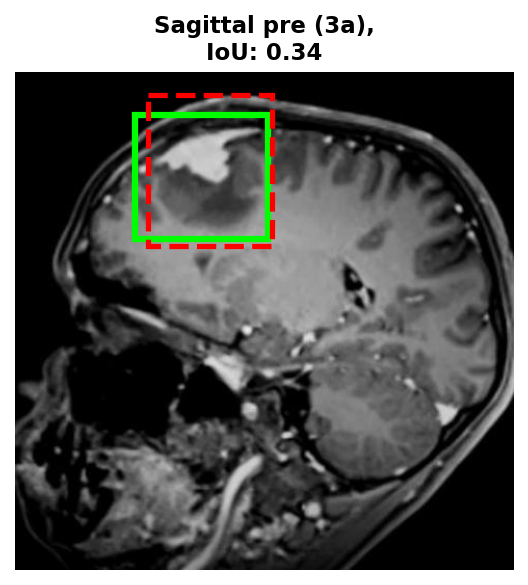
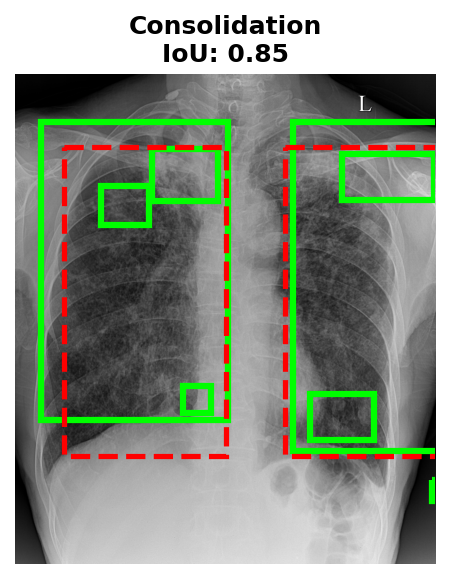
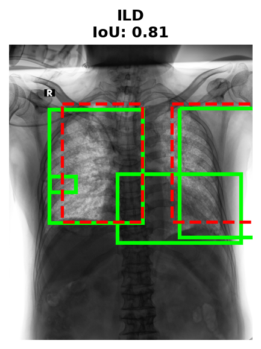
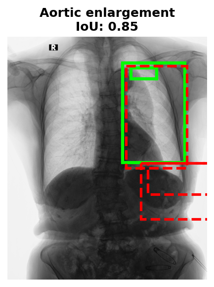
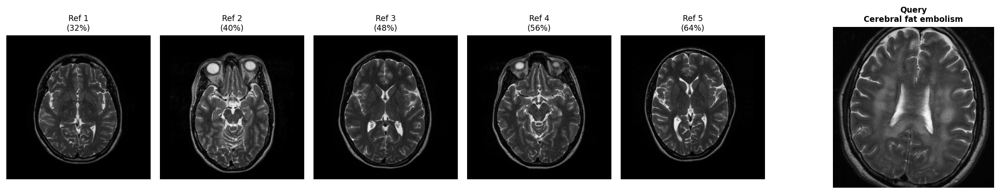
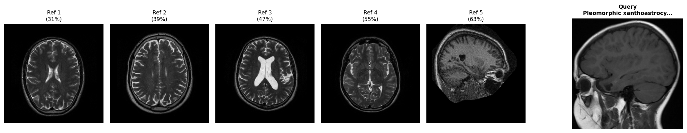
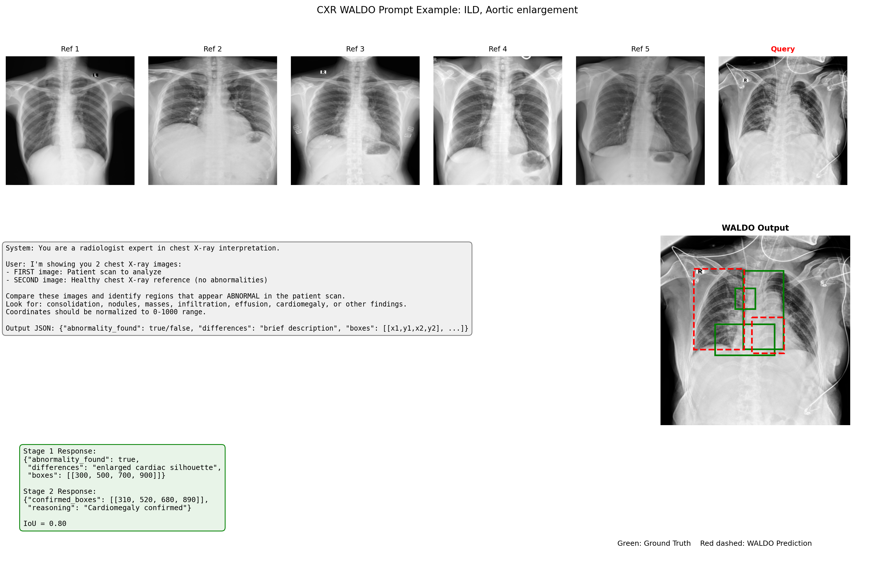

# WALDO: Wasserstein-Aligned Localisation via Differential Observations

A training-free framework for zero-shot medical anomaly localisation using vision-language models with optimal transport-based reference selection.

<p align="center">
  
</p>

## Key Features

- **Zero-shot localisation**: No training on target domain required
- **Differential prompting**: Compare query images against healthy references to identify anomalies
- **Optimal transport reference selection**: Use Sliced Wasserstein Distance on DINOv2 embeddings to select diverse, relevant references
- **Self-consistency aggregation**: Aggregate predictions across multiple reference sets using weighted NMS

## Results

### NOVA Brain MRI

| Method | mAP@30 | mAP@50 | Avg IoU |
|--------|--------|--------|---------|
| Zero-shot (Qwen3-32B) | 53.3% | 30.0% | 32.9% |
| **WALDO (Qwen3-32B)** | **63.3%** | **43.3%** | **39.2%** |
| Improvement | +10.0% | +13.3% | +6.3% |

### VinDr-CXR (n=949)

| Method | mAP@30 | mAP@50 | Avg IoU |
|--------|--------|--------|---------|
| Zero-shot (Qwen3-32B) | 12.8% | 4.3% | 8.9% |
| **WALDO (Qwen3-32B)** | **34.1%** | **10.7%** | **22.2%** |
| Improvement | +21.3% | +6.4% | +13.3% |

<p align="center">
  
  
</p>

*IoU distribution analysis by lesion size (left panels) and disease type (right panels).*

## Qualitative Examples

### NOVA Brain MRI Localisation

| High IoU (0.87) | Medium IoU (0.62) | Challenging (0.34) |
|:---------------:|:-----------------:|:------------------:|
| _FLAIR_hype_iou0.87.png) | _iou0.62.png) |  |
| FLAIR hyperintensity | Axial T1 lesion | Sagittal pre-contrast |

### VinDr-CXR Localisation

| Consolidation (0.85) | ILD (0.81) | Aortic Enlargement (0.85) |
|:--------------------:|:----------:|:-------------------------:|
|  |  |  |

*Green boxes: Ground truth annotations. Red dashed boxes: WALDO predictions.*

More qualitative examples are available in `figures/qualitative_samples/` (30 NOVA + 30 CXR samples).

## Prompt Examples

WALDO uses differential prompting to compare query images against healthy references:

### Stage 1: Differential Analysis (Brain MRI)
<p align="center">
  
</p>

### Stage 2: Cross-Validation
<p align="center">
  
</p>

### Chest X-Ray Prompting
<p align="center">
  
</p>

## Installation

```bash
pip install -r requirements.txt
```

## Quick Start

### Reading Pre-computed Results

The `results/` directory contains raw predictions for all experiments in the paper:

```bash
# Analyze all results
python scripts/read_results.py --dataset all

# Analyze specific dataset
python scripts/read_results.py --dataset nova
python scripts/read_results.py --dataset cxr
```

### Using WALDO

```python
from waldo import WALDO, WassersteinReferenceSelector

# Initialize with your VLM client
waldo = WALDO(
    vlm_client=your_openai_client,
    model="qwen2.5-vl-72b",
    n_views=5,
    n_references=3,
)

# Localize anomalies
result = waldo.localize(
    query_image=query_rgb,
    reference_pool=healthy_references,
    modality="mri"  # or "cxr"
)

print(f"Found {len(result['boxes'])} anomaly regions")
```

## Repository Structure

```
waldo-demo/
├── waldo/                         # Core WALDO implementation
│   ├── __init__.py
│   ├── waldo.py                   # Main WALDO class
│   ├── reference_selector.py      # SWD-based reference selection
│   └── metrics.py                 # Evaluation metrics
├── scripts/
│   └── read_results.py            # Results reader and analyzer
├── results/                        # Raw experimental results
│   ├── nova/                      # NOVA brain MRI results (2 files)
│   └── cxr/                       # VinDr-CXR results (6 files)
├── figures/
│   ├── waldo_method_overview.png  # Method diagram
│   ├── nova_analysis_violin.png   # NOVA IoU analysis
│   ├── cxr_analysis_violin.png    # CXR IoU analysis
│   ├── disease_examples_grid.pdf  # Disease type examples
│   ├── prompts/                   # Prompt examples (3 files)
│   └── qualitative_samples/       # Localisation examples
│       ├── nova/                  # 30 brain MRI samples
│       └── cxr/                   # 30 chest X-ray samples
└── requirements.txt
```

## Results File Format

Each JSON results file contains:

```json
{
  "results": [
    {
      "image_id": "...",
      "iou": 0.52,
      "hit_30": true,
      "hit_50": true,
      "n_pred": 2,
      "n_gt": 3,
      "pred_boxes": [[x1, y1, x2, y2], ...],
      "gt_boxes": [[x1, y1, x2, y2], ...]
    },
    ...
  ]
}
```

## Method Overview

WALDO consists of three stages:

1. **Reference Selection**: Use entropy-weighted Sliced Wasserstein Distance on DINOv2 patch embeddings to select diverse, anatomically-aligned healthy references

2. **Differential Prompting**: Query a VLM with the patient image and selected references, asking it to identify regions that differ from normal anatomy

3. **Self-Consistency Aggregation**: Repeat with different reference subsets and aggregate predictions using weighted NMS

## Citation

```bibtex
@inproceedings{waldo2026,
  title={WALDO: Wasserstein-Aligned Localisation via Differential Observations for Zero-Shot Medical Anomaly Detection},
  author={...},
  booktitle={Medical Image Computing and Computer Assisted Intervention (MICCAI)},
  year={2026}
}
```

## License

MIT License
