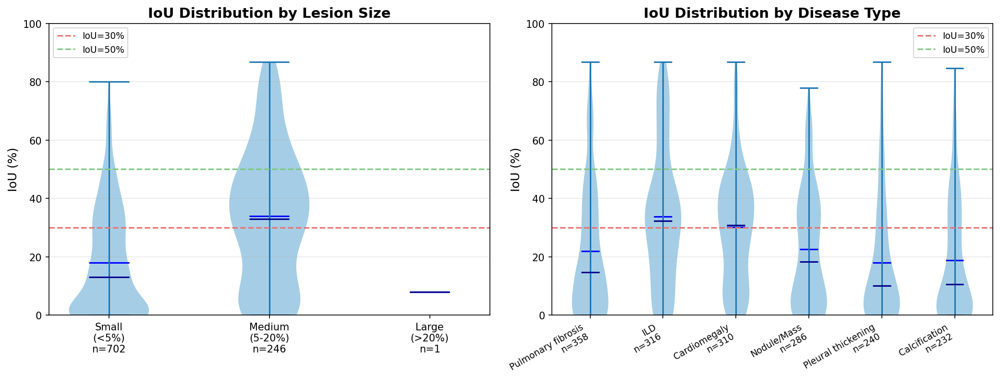

# WALDO: Wasserstein-Aligned Localisation for VLM-Based Distributional OOD Detection

A **training-free** framework for zero-shot medical anomaly localisation. WALDO selects
anatomically-appropriate healthy references with an **entropy-weighted Sliced Wasserstein
distance** over **DINOv3** patch distributions, then prompts a vision-language model (VLM)
to localise regions of a query scan that differ from those references.

<p align="center">
  
</p>

> **Disclaimer — distilled reference implementation.**
> This repository is a clean, self-contained reference implementation of the WALDO method,
> **distilled by Claude and Codex coding agents from a larger internal experimentation
> codebase**. It faithfully implements the algorithm and hyper-parameters described in the
> paper, but it is **not** the exact multi-script, multi-day cluster pipeline that produced
> the published tables. Reproducing the paper numbers requires the full datasets, the
> DINOv3-ViT-B/16 backbone (gated on the HuggingFace Hub), and VLM API access. The numbers
> reported below are the **published paper results**; the JSON files in [`results/`](results/)
> are the genuine full-run, per-image outputs that back them (NOVA *n*=906, VinDr-CXR *n*=949).
> See [DISCLAIMER.md](DISCLAIMER.md).

## Method

WALDO proceeds in three stages (paper, Sec. *Method*):

1. **Reference selection.** Extract DINOv3-ViT-B/16 patch tokens, weight each patch by its
   softmax-Shannon entropy, and score every healthy reference by the entropy-weighted,
   squared **Sliced Wasserstein** distance to the query (*M*=100 projections). Keep references
   in the **Goldilocks zone** (30th–70th percentile of distance, α=0.3) and pick *K*=5 diverse
   ones with a **Determinantal Point Process** (greedy log-det MAP).
2. **Differential prompting (Stage 1).** For *K₁*=3 references, ask the VLM to compare the
   patient scan against the healthy reference and box the regions that differ; aggregate with
   confidence-weighted NMS (IoU=0.5). Per-reference confidence is `c·exp(−λ·SW)`, λ=0.1.
3. **Refinement (Stage 2).** Re-present the Stage-1 candidates against *K₂*=2 further references
   to confirm / refine / reject, then aggregate again.

VLM sampling uses temperature 0.7 and top-p 0.95. Images are resized to 512×512 for feature
extraction and 1024×1024 for VLM inference.

## Results

These are the **published paper results**. Mean with standard error subscript; mAP at
IoU thresholds 0.30 / 0.50. Per-image JSONs are provided in [`results/`](results/) for the
rows marked ✓.

### NOVA brain MRI (seed 42)

`n` is the evaluation sample size: 906 (full NOVA test set) for the open Qwen/Gemini full
runs; 50 for the API-cost-limited rows (which is why those rows have wider CIs in the paper).

| Model | Method | n | mAP@30 (%) | mAP@50 (%) | Avg IoU (%) | JSON |
|---|---|:--:|---|---|---|:--:|
| Qwen2.5-VL-72B | Zero-shot (rep.) | 906 | 36.4 | 23.4 | 23.6 | ✓ |
| **Qwen2.5-VL-72B** | **WALDO** | 906 | **43.5** | **26.3** | **29.6** | ✓ |
| GPT-4o | Zero-shot | 50 | 19.0 | 3.0 | 14.2 | † |
| GPT-4o | WALDO | 50 | 32.0 | 14.0 | 21.7 | † |
| Qwen3-VL-32B | Zero-shot | 906 | 20.4 | 13.8 | 13.8 | ✓ |
| Qwen3-VL-32B | WALDO | 50 | 32.0 | 18.0 | 22.7 | ✓ |
| Qwen3-VL-235B (MoE) | Zero-shot | 906 | 36.3 | 20.1 | 25.1 | ✓ |
| Qwen3-VL-235B (MoE) | WALDO | 906 | 31.8 | 15.2 | 21.7 | ✓ |
| Gemini-2.0-Flash | Zero-shot (rep.) | 906 | 18.1 | 6.4 | 15.2 | ✓ |
| Gemini-2.0-Flash | WALDO | 50 | 38.0 | 10.0 | 24.5 | ✓ |

Primary result: WALDO with Qwen2.5-VL-72B reaches **43.5% mAP@30** (95% CI [40.4, 46.7]),
a +19.5% relative improvement over the zero-shot reproduction (36.4%); a paired McNemar test
on hit@30 confirms significance (*p*=1.8×10⁻⁶). Per-image JSONs are shipped for every ✓ row
and recompute to the value shown. **†** GPT-4o NOVA figures are still on the cluster [TODO].

### VinDr-CXR (*n*=949 with ≥1 annotated finding)

| Model | Method | mAP@30 (%) | mAP@50 (%) | Avg IoU (%) | JSON |
|---|---|---|---|---|:--:|
| Qwen2.5-72B | Zero-shot | 18.7 | 4.0 | 14.4 | ✓ |
| **Qwen2.5-72B** | **WALDO** | **22.3** | **5.7** | **18.2** | ✓ |
| Qwen3-32B | Zero-shot | 12.8 | 4.3 | 8.9 | ✓ |
| **Qwen3-32B** | **WALDO** | **34.1** | **10.7** | **22.2** | ✓ |
| GPT-4o | Zero-shot | 3.3 | 0.4 | 2.3 | ✓ |
| **GPT-4o** | **WALDO** | **10.9** | **1.5** | **9.4** | ✓ |

**✓** = a per-image JSON for this row is shipped in [`results/`](results/). The tables
above quote the **paper** values. Recomputing the shipped JSONs with `read_results.py`
reproduces them to within run-to-run variance: every **WALDO** row matches to ≤0.1 pp, and
the only baseline that differs by more is the Qwen2.5-72B CXR zero-shot cell, which the
shipped run recomputes to **18.3%** vs the **18.7%** reported (GPT-4o CXR zero-shot
recomputes to 3.4% vs 3.3%). These sub-0.5 pp gaps are stochastic VLM run variance and do
not affect any conclusion.

<p align="center">
  
  
</p>

*IoU distribution stratified by lesion size and disease category (NOVA left, VinDr-CXR right).*

## Installation

```bash
git clone https://github.com/bkainz/WALDO_MICCAI26_demo.git
cd WALDO_MICCAI26_demo
pip install -e .                 # core
pip install -e ".[viz,cxr]"      # + visualisation and CXR DICOM support
```

The DINOv3-ViT-B/16 backbone (`facebook/dinov3-vitb16-pretrain-lvd1689m`) is **gated** on the
HuggingFace Hub: accept its licence and run `huggingface-cli login`. If it cannot be loaded the
run **raises** with setup instructions — it does not silently switch backbones. For a quick
non-paper smoke test, pass `--allow-dinov2-fallback` (scripts) or
`WALDO(..., allow_dinov2_fallback=True)` to use `facebook/dinov2-base` instead.

## Quick start

```bash
# 1. Reference-selection demo on one NOVA sample (no API key; downloads DINOv3 + NOVA)
python examples/quickstart.py

# 2. Full inference (requires a VLM API key)
export OPENAI_API_KEY="your-key"
python scripts/run_inference.py --dataset nova --model gpt-4o --n-samples 10

# 3. Inspect the shipped paper results
python scripts/read_results.py --dataset all
```

```python
from waldo import WALDO

waldo = WALDO(vlm_client=your_openai_client, model="qwen2.5-vl-72b")  # see scripts/run_inference.py
result = waldo.localize(query_rgb, healthy_references, modality="mri")
print(result["boxes"])  # final boxes in 0-1000 normalised coordinates
```

## Datasets

- **NOVA** (brain MRI) downloads automatically from HuggingFace (`c-i-ber/Nova`). Note: the
  parquet annotations are **not** sorted by filename while the images are — the loaders build
  the correct filename→index mapping (`scripts/download_datasets.py`, `waldo/data_loader.py`).
- **VinDr-CXR** requires credentialed PhysioNet access; `scripts/download_datasets.py --dataset cxr`
  prints setup instructions. "No finding" cases are used as healthy references.

## Repository structure

```
waldo-demo/
├── waldo/
│   ├── reference_selector.py   # DINOv3 + entropy-weighted Sliced Wasserstein + Goldilocks + DPP
│   ├── waldo.py                # two-stage differential prompting + confidence-weighted NMS
│   ├── prompting.py            # paper differential / refinement prompts
│   ├── preprocessing.py        # DINOv3 feature extractor + coordinate transforms
│   ├── data_loader.py          # NOVA / VinDr-CXR loaders (with NOVA alignment fix)
│   ├── metrics.py              # IoU, mAP@30/50, bootstrap CI
│   ├── batch_inference.py      # checkpointing / rate limiting utilities
│   └── visualization.py        # bounding-box drawing
├── scripts/                    # download_datasets.py, run_inference.py, read_results.py
├── examples/quickstart.py
├── results/                    # genuine full-run per-image JSONs (NOVA n=906, CXR n=949)
│   ├── nova/                   # 8 files (zero-shot + WALDO for Qwen2.5-72B, Qwen3-32B, Qwen3-235B, Gemini)
│   └── cxr/                    # 6 files (zero-shot + WALDO for GPT-4o, Qwen2.5-72B, Qwen3-32B)
├── figures/                    # method diagram, violin plots, 30 NOVA + 30 CXR qualitative samples
├── DISCLAIMER.md
├── USAGE.md
├── requirements.txt
└── setup.py
```

## Results file format

NOVA JSONs contain `config`, `metrics` (mAP@30/50, avg IoU, std-err, 95% CI), and
`detailed_results` (per-image `filename`, `iou`, `hit_30`, `hit_50`). VinDr-CXR JSONs
additionally contain `pred_boxes`, `gt_boxes`, and raw VLM `responses` per image.

## Citation

```bibtex
@inproceedings{kainz2026waldo,
  title     = {Wasserstein-Aligned Localisation for VLM-Based Distributional OOD
               Detection in Medical Imaging},
  author    = {Kainz, Bernhard and Mueller, Johanna P. and Baugh, Matthew M. G.
               and Bercea, Cosmin I.},
  booktitle = {Medical Image Computing and Computer Assisted Intervention (MICCAI)},
  year      = {2026}
}
```

## License

MIT License. See [DISCLAIMER.md](DISCLAIMER.md) for notes on the AI-assisted distillation
of this code and on the intended (research / triage) use of the method.
